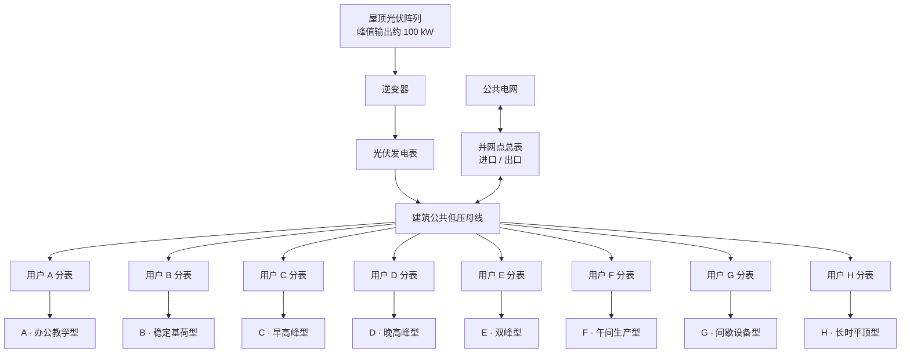

# GreenProof 后续开发需求表

本文件记录已提出、但尚未进入实现阶段的产品需求。需求中的功率和拓扑均为 Pilot 模拟参数，不代表真实建筑电气设计，也不能替代电气工程师出图。

## 需求总览

| 编号 | 需求 | 优先级 | 当前状态 | 验收摘要 |
|---|---|---:|---|---|
| FR-01 | 将模拟用户从 2 个扩展为 8 个 | 高 | 待开发 | 系统可加载、计算和展示 8 个独立用户，能量守恒测试通过 |
| FR-02 | 每个用户峰值负荷约 10 kW | 高 | 待开发 | 8 个用户峰值控制在 9–11 kW，并清楚标记为模拟/缩放数据 |
| FR-03 | 8 条负荷曲线具有不同形状 | 高 | 待开发 | 曲线在峰值时间、基荷、爬坡和波动特征上可辨识，不能仅复制后平移 |
| FR-04 | 屋顶光伏峰值发电功率约 100 kW | 高 | 待开发 | 模拟日的光伏输出峰值为 95–100 kW，额定容量与输出峰值分别标注 |
| FR-05 | 建立典型多用户配电拓扑数字孪生 | 高 | 待开发 | 页面展示光伏、逆变器、发电表、公共母线、8 个分支电表、用户和电网连接点 |
| FR-06 | 拓扑节点可点击钻取 | 高 | 待开发 | 点击任一用户，展示其需求、同期绿电消纳、电网补足和逐时曲线 |
| FR-07 | 8 用户分配与证据包兼容 | 高 | 待开发 | 匹配引擎、汇总、EvidencePackage、Merkle proof 和验证器不再假设恰好 2 个用户 |
| FR-08 | 大规模场景仍保持可解释性 | 中 | 待开发 | 默认视图不过载；支持总览、选中用户详情和异常/高峰提示 |

## 模拟场景参数

| 对象 | 数量 | 建议参数 | 说明 |
|---|---:|---|---|
| 屋顶光伏 | 1 | 峰值输出 95–100 kW | 使用平滑日照曲线，并保留阴云波动场景；额定 kWp 与当日实际峰值 kW 分开 |
| 模拟用户 | 8 | 单户峰值 9–11 kW | 峰值接近但形状不同，避免因量级差异掩盖分配逻辑 |
| 用户分表 | 8 | 每户 1 个双向/进口计量节点 | Pilot 中为逻辑电表，不宣称真实硬件计量 |
| 光伏发电表 | 1 | 记录每个时间区间的发电量 | 与逆变器输出绑定 |
| 公共并网点 | 1 | 记录总进口与总出口 | 展示光伏不足时购电、富余时上网 |
| 时间粒度 | 24×1小时或 48×30分钟 | 优先 30 分钟 | 与英国结算和公开负荷数据的常见粒度更接近 |

## 八类建议负荷形状

| 用户 | 峰值目标 | 负荷形状 | 典型特征 |
|---|---:|---|---|
| A | 10.0 kW | 办公教学型 | 08:00 后快速上升，午间高位，18:00 后下降 |
| B | 9.8 kW | 稳定基荷型 | 全天基荷较高，日间只有小幅增加 |
| C | 10.2 kW | 早高峰型 | 07:00–10:00 峰值明显，午后下降 |
| D | 10.0 kW | 晚高峰型 | 白天较低，16:00–21:00 达到峰值 |
| E | 9.6 kW | 双峰型 | 上午和傍晚各有一次峰值 |
| F | 10.4 kW | 午间生产型 | 11:00–15:00 与光伏高发时段重合 |
| G | 9.9 kW | 间歇设备型 | 基荷之上出现数次短时设备运行峰值 |
| H | 10.1 kW | 长时平顶型 | 工作时段维持较平稳的高负荷平台 |

所有曲线必须由确定性 fixture 或有来源记录的公开曲线生成。若进行缩放，数据点使用 `profile_scaled` provenance，并记录目标峰值、缩放因子和源曲线标识。

## 目标配电拓扑

该图只表达计量和能量流关系。正式 Pilot 若接入真实建筑，回路保护、相别、线径、CT 方向、表计精度和接线方式必须由合格电气人员确认。

## 前端交互要求

1. 默认展示光伏、公共母线、并网点和 8 个用户节点，不同时展开 8 份详情。
2. 用户节点显示当前功率、同期获得的屋顶绿电和电网补足量。
3. 点击用户后，在拓扑下方展开：
   - 光伏输出与该用户负荷曲线；
   - 该用户逐时绿电消纳柱状图；
   - 选中时间区间的计算式和 Wh 级结果；
   - 当日总需求、绿电消纳、绿电占比和电网补足。
4. 点击光伏节点后，展示发电、现场消纳、上网和未利用/弃电（如场景定义）的曲线。
5. 桌面端使用拓扑图；移动端改为可横向滚动或分组折叠的节点列表，不能缩成不可读的电路图。

## 引擎和证据改造要求

- 删除“必须恰好两个租户”的数据契约限制，改为 1–N 个用户，并为 MVP 设置合理上限。
- 所有分配规则必须在 8 用户场景下满足：分配总和等于现场消纳、单用户分配不超过需求、进口和出口守恒。
- EvidencePackage 必须绑定完整用户列表、用户顺序、每户区间分配和汇总。
- 删除、重复、重排或修改任一用户及其任一时间点 1 Wh，独立验证器都必须失败。
- Golden Dataset 增加固定 8 用户 fixture，但保留现有 2 用户 fixture 作为向后兼容测试。

## 完成定义

- 8 用户模拟场景、数据来源/生成方法和缩放参数均有文档；
- 100 kW 峰值光伏和 8×约10 kW 用户在界面中的单位正确；
- 拓扑及用户钻取在桌面和移动端可用；
- 原有 2 用户场景仍可加载，或提供明确的版本迁移说明；
- 引擎随机守恒测试、8 用户 Golden Dataset、1 Wh 篡改测试、Lint、TypeScript 和生产构建全部通过；
- 页面继续明确标注为模拟 Pilot，不构成真实电气图、正式计量或绿证。
